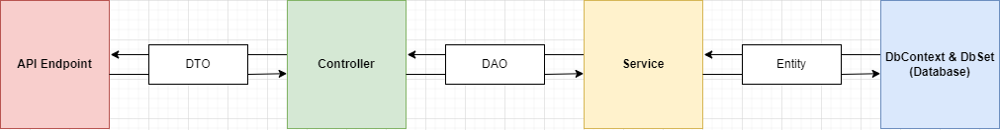

# 4kTiles - Backend
## Module Purpose
- `Context`: the DbContext
- `Entities`: the Models for the Database
- `Controllers`: the API controllers, which is the endpoint of the API system
- `Services`: the logic code to interact with `Context` & `Entities`
- `DataObjects`: the objects to transfer between modules
  - `DTO`: Transfer between `Services` - `Controllers`
  - `DAO`: Transfer between `Context` - `Services` & `Services` - `Services`
- `Mappers`: Map properties from one object to another, use to convert `Entities` to `DataObjects` and vice versa
  - https://codelearn.io/sharing/su-dung-automapper-trong-csharp
- `Helpers`: The utility methods to be used in some classes

## Project Graph
